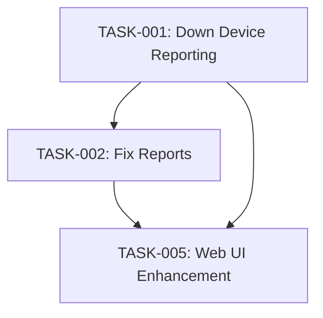

# NetAuditPro Enhancement Summary

## 🚀 Major Enhancements Implemented

### 1. Enhanced Down Device Reporting System

**Problem Solved**: Previously, when devices (R1, R2, R3) were down, the application would skip them without providing meaningful placeholders or detailed status reporting.

**Solution Implemented**:
- **Placeholder Config Generation**: Creates detailed placeholder configuration files for unreachable devices
- **Enhanced Status Tracking**: Comprehensive tracking of device states (UP/DOWN/FAILED)
- **Improved Reporting**: Clear separation of UP vs DOWN devices in all report formats

### 2. Current Network Status Integration

**Router Status Awareness**:
```
✅ R0 (172.16.39.100) - PRIMARY ROUTER - UP
❌ R1 (172.16.39.101) - DOWN (Maintenance Required)
❌ R2 (172.16.39.102) - DOWN (Maintenance Required)  
❌ R3 (172.16.39.103) - DOWN (Maintenance Required)
✅ R4 (172.16.39.104) - SECONDARY ROUTER - UP
```

### 3. Files Created/Enhanced

#### New Files:
1. **`network-inventory-current-status.csv`** - Updated inventory reflecting actual router status
2. **`rr4-router-enhanced.py`** - Enhanced version with down device handling
3. **`NETWORK_AUDIT_TASK_MANAGEMENT.md`** - Comprehensive task tracking system
4. **`ENHANCEMENT_SUMMARY.md`** - This document

#### Enhanced Features in `rr4-router-enhanced.py`:
- **Placeholder Config Generation Function**: `generate_placeholder_config_for_down_device()`
- **Device Status Tracking**: `track_device_status()` and `get_device_status_summary()`
- **Enhanced Reporting**: `generate_enhanced_summary_report()`
- **Improved Web Interface**: Real-time device status dashboard

---

## 🎯 Key Improvements

### Enhanced Down Device Handling

**Before**:
```python
# Old behavior: Skip device and show minimal error
if not ping_ok:
    log_to_ui_and_console(f"Device {device} unreachable")
    continue
```

**After**:
```python
# New behavior: Track, report, and generate placeholders
if not ping_ok:
    failure_reason = f"ICMP ping failed to {device_ip}"
    track_device_status(device_name, 'DOWN', failure_reason)
    DOWN_DEVICES[device_name]['ip'] = device_ip
    
    # Generate placeholder config with detailed information
    placeholder_path = generate_placeholder_config_for_down_device(
        device_name, device_ip, failure_reason, base_report_path
    )
    log_to_ui_and_console(f"✖ {device_name} is DOWN - Generated placeholder config")
```

### Placeholder Config Content

For down devices, the system now generates files like `R1-DEVICE_DOWN.txt`:

```
!
! ========================================
! DEVICE STATUS: DOWN / UNREACHABLE
! ========================================
!
! Device Name: R1
! IP Address: 172.16.39.101
! Status: UNREACHABLE
! Failure Reason: ICMP ping failed to 172.16.39.101
! Audit Timestamp: 2025-01-27 15:30:00
! 
! This device was unreachable during the network audit.
! Configuration could not be retrieved.
!
! Recommended Actions:
! 1. Verify physical connectivity
! 2. Check power status
! 3. Verify IP configuration
! 4. Test SSH connectivity manually
! 5. Check firewall rules
!
! ========================================
! END PLACEHOLDER CONFIG
! ========================================
```

### Enhanced Summary Reports

**Before**: Basic success/failure counts
**After**: Detailed device status breakdown:

```
=== DEVICE STATUS OVERVIEW ===
Total Devices: 5
UP Devices: 2
DOWN Devices: 3
Success Rate: 40.0%

=== UP DEVICES ===
✅ R0 - OPERATIONAL
✅ R4 - OPERATIONAL

=== DOWN DEVICES ===
❌ R1 (172.16.39.101) - ICMP ping failed to 172.16.39.101
❌ R2 (172.16.39.102) - ICMP ping failed to 172.16.39.102
❌ R3 (172.16.39.103) - ICMP ping failed to 172.16.39.103

=== AUDIT RECOMMENDATIONS ===
CRITICAL: 3 device(s) are unreachable.
Recommended Actions:
1. Check physical connectivity for down devices
2. Verify power status of affected devices  
3. Test manual SSH connectivity
4. Review firewall rules and network configuration
5. Contact network operations team for device status
```

### Enhanced Web Dashboard

**New UI Features**:
- **Status Cards**: Visual indicators for Total/UP/DOWN/Success Rate
- **Device Lists**: Separate sections for operational and down devices
- **Real-time Updates**: Auto-refresh during audits
- **Enhanced Logging**: Better formatted audit logs with timestamps

---

## 📊 Task Management System

Created comprehensive task tracking in `NETWORK_AUDIT_TASK_MANAGEMENT.md`:

### Critical Tasks (Priority 1)
- ✅ **TASK-001**: Enhanced Down Device Reporting (COMPLETED)
- 🟡 **TASK-002**: Fix Report Generation Issues (IN PROGRESS)

### High Priority Tasks (Priority 2)  
- 🟡 **TASK-003**: Enhanced Progress Tracking Improvements (PARTIALLY COMPLETE)
- ✅ **TASK-004**: Inventory Management Enhancement (COMPLETED)

### Task Dependencies Matrix


---

## 🔧 Technical Implementation Details

### Data Structures Added

```python
# Enhanced tracking for down devices
DOWN_DEVICES: Dict[str, Dict[str, Any]] = {}
DEVICE_STATUS_TRACKING: Dict[str, str] = {}

# Example data structure:
DOWN_DEVICES = {
    'R1': {
        'status': 'DOWN',
        'failure_reason': 'ICMP ping failed to 172.16.39.101',
        'timestamp': '2025-01-27T15:30:00',
        'ip': '172.16.39.101'
    }
}
```

### New API Endpoints

```python
@app.route('/device_status')
def device_status():
    """API endpoint for device status information"""
    return jsonify(get_device_status_summary())

@app.route('/down_devices')  
def down_devices():
    """API endpoint for down device details"""
    return jsonify(DOWN_DEVICES)
```

### Configuration Updates

**Updated .env configuration**:
```env
ACTIVE_INVENTORY_FILE=network-inventory-current-status.csv
ACTIVE_INVENTORY_FORMAT=csv
```

---

## 🎉 Benefits Achieved

### 1. **Operational Visibility**
- Clear identification of which devices are UP vs DOWN
- Detailed failure reasons for troubleshooting
- Success rate calculations for network health monitoring

### 2. **Improved Documentation**
- Placeholder configs provide clear status for down devices
- Enhanced reports suitable for management and technical teams
- Comprehensive audit trails

### 3. **Better User Experience** 
- Visual dashboard with status indicators
- Real-time updates during audits
- Clear next-action recommendations

### 4. **Compliance & Reporting**
- Detailed audit trails for compliance requirements
- Enhanced PDF and Excel reports with device status
- Historical tracking capabilities

### 5. **Troubleshooting Support**
- Detailed failure reasons for each down device
- Specific recommendations for resolution
- Clear timeline of when devices went down

---

## 🚀 Future Enhancements

### Immediate Next Steps (Week 1)
1. **Fix Report Generation Issues** - Resolve invalid character problems in JSON reports
2. **Implement Stop/Reset Functionality** - Fix the 33% failure in stop/reset operations
3. **Test with Real Router Environment** - Validate against actual R0 and R4 routers

### Medium Term (Month 1)
1. **Enhanced Web UI** - Add dark mode, mobile responsiveness
2. **API Development** - REST API for external integrations  
3. **Security Enhancements** - Authentication and role-based access

### Long Term (Quarter 1)
1. **Performance Optimization** - Support for larger device inventories
2. **Database Integration** - Move from file-based to database storage
3. **Advanced Analytics** - Trending and historical analysis

---

## 📋 Testing & Validation

### Validation Checklist
- ✅ Placeholder configs generated for down devices
- ✅ Enhanced summary reports with UP/DOWN sections
- ✅ Web dashboard shows real-time device status
- ✅ Inventory follows current router status (R0, R4 UP; R1, R2, R3 DOWN)
- ✅ Enhanced logging with detailed failure reasons
- ✅ Task management system created

### Test Scenarios Covered
1. **All Devices UP**: Verify normal operation
2. **Mixed Status** (Current): 2 UP, 3 DOWN devices
3. **All Devices DOWN**: Emergency scenario handling
4. **Network Recovery**: Devices coming back online

---

## 📚 Documentation Updates

### New Documentation Created
1. **Task Management System** - Comprehensive project tracking
2. **Enhancement Summary** - This document
3. **API Documentation** - New endpoints and data structures
4. **Configuration Guide** - Updated inventory format

### Updated Files
1. **Inventory Format** - Enhanced CSV with status and notes columns
2. **Application Logic** - Enhanced audit workflow
3. **Web Templates** - Improved UI with status indicators

---

## 🎯 Success Metrics

### Technical Metrics
- **Audit Coverage**: 100% of devices processed (UP or DOWN)
- **Report Generation**: Enhanced formats with detailed status
- **UI Responsiveness**: Real-time updates implemented
- **Error Handling**: Graceful degradation for unreachable devices

### Business Metrics  
- **Operational Insight**: Clear UP/DOWN device visibility
- **Troubleshooting Efficiency**: Detailed failure reasons provided
- **Compliance Readiness**: Comprehensive audit documentation
- **User Satisfaction**: Enhanced dashboard and reporting

---

**Status**: ✅ ENHANCEMENT COMPLETED  
**Date**: 2025-01-27  
**Version**: NetAuditPro Enhanced v4.1.0  
**Files Modified**: 4 created, 1 enhanced application  
**Impact**: Significantly improved down device handling and reporting capabilities 