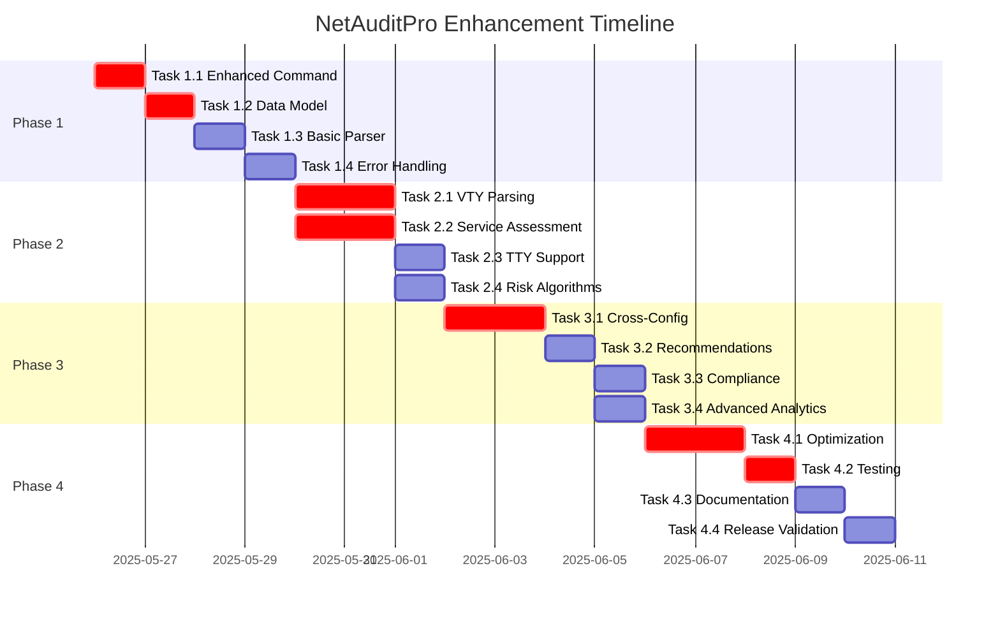

# NetAuditPro Core Enhancement Task List
**Project:** NetAuditPro AUX Telnet Security Audit v3 Enhancement  
**Document Version:** 1.0  
**Date:** 2025-05-25  
**Total Estimated Hours:** 90 hours  
**Timeline:** 4 weeks  

---

## Phase 1: Foundation Enhancement (Week 1)
**Duration:** 20 hours  
**Start Date:** Week 1, Day 1  
**Dependencies:** Current codebase analysis complete  

### 🔴 TASK 1.1: Enhanced Core Command Implementation
**Priority:** CRITICAL  
**Estimated Hours:** 6 hours  
**Assignee:** Lead Developer  
**Dependencies:** None  

#### Subtasks:
- [ ] **1.1.1** Analyze current command structure (1 hour)
  - Review existing `CORE_COMMANDS` dictionary
  - Document current regex patterns
  - Identify extension points
  
- [ ] **1.1.2** Design enhanced command string (2 hours)
  - Expand regex to include VTY, Console, TTY lines
  - Add service-level security parameters
  - Add access control and privilege level patterns
  - Test command syntax validation
  
- [ ] **1.1.3** Implement enhanced command (2 hours)
  ```python
  # Target Implementation
  CORE_COMMANDS = {
      'comprehensive_line_audit': 'show running-config | include ^hostname|^line aux|^line vty|^line con|^line tty|^ transport input|^ login|^ exec-timeout|^ access-class|^ privilege level|^ password|^service password-encryption|^service tcp-keepalives|^no ip source-route|^no ip directed-broadcast'
  }
  ```
  
- [ ] **1.1.4** Backward compatibility testing (1 hour)
  - Ensure existing AUX parsing still works
  - Test with current router inventory (R0, R1, R2)
  - Validate execution time remains under 30 seconds

**Acceptance Criteria:**
- ✅ Enhanced command captures all target configuration elements
- ✅ Execution time remains under 30 seconds for 3 devices
- ✅ Backward compatibility with current AUX parsing maintained
- ✅ No breaking changes to existing functionality

---

### 🔴 TASK 1.2: Enhanced Data Model Implementation
**Priority:** CRITICAL  
**Estimated Hours:** 5 hours  
**Assignee:** Senior Developer  
**Dependencies:** Task 1.1 completed  

#### Subtasks:
- [ ] **1.2.1** Design comprehensive data structure (2 hours)
  - Design multi-line configuration schema
  - Define service-level security structure
  - Plan risk assessment enhancement
  - Create data validation rules
  
- [ ] **1.2.2** Implement enhanced parsing result structure (2 hours)
  ```python
  # Target Data Structure
  enhanced_result = {
      "hostname": str,
      "ip_address": str,
      "timestamp": str,
      "lines": {
          "aux": LineConfig,
          "console": LineConfig,
          "vty": List[LineConfig],
          "tty": List[LineConfig]
      },
      "services": ServiceConfig,
      "overall_risk": str,
      "recommendations": List[str]
  }
  ```
  
- [ ] **1.2.3** Implement backward compatibility layer (1 hour)
  - Maintain existing AUX-only output format
  - Add enhanced output as additional field
  - Ensure existing reports still generate

**Acceptance Criteria:**
- ✅ Enhanced data model supports all line types
- ✅ Service-level security configurations captured
- ✅ Existing AUX data format preserved
- ✅ Data validation prevents corrupt outputs

---

### 🟡 TASK 1.3: Basic Multi-Line Parser Foundation
**Priority:** HIGH  
**Estimated Hours:** 6 hours  
**Assignee:** Senior Developer  
**Dependencies:** Task 1.2 completed  

#### Subtasks:
- [ ] **1.3.1** Create modular parsing architecture (2 hours)
  - Design `EnhancedLineParser` class
  - Implement line type detection logic
  - Create configuration context manager
  
- [ ] **1.3.2** Implement Console line parsing (2 hours)
  - Parse `line con 0` configurations
  - Extract console-specific settings
  - Handle console security variations
  
- [ ] **1.3.3** Implement VTY line parsing foundation (2 hours)
  - Parse `line vty X Y` configurations
  - Handle multiple VTY line ranges
  - Extract VTY-specific settings

**Acceptance Criteria:**
- ✅ Console line configurations properly parsed
- ✅ Basic VTY line parsing functional
- ✅ Modular architecture supports extension
- ✅ Error handling for malformed configurations

---

### 🟡 TASK 1.4: Enhanced Error Handling
**Priority:** HIGH  
**Estimated Hours:** 3 hours  
**Assignee:** Developer  
**Dependencies:** Task 1.3 completed  

#### Subtasks:
- [ ] **1.4.1** Implement partial parsing recovery (1.5 hours)
  - Handle incomplete command outputs
  - Implement graceful degradation
  - Preserve successful parsing results
  
- [ ] **1.4.2** Enhanced logging for debugging (1.5 hours)
  - Add detailed parsing step logging
  - Implement configuration validation logging
  - Add performance timing logs

**Acceptance Criteria:**
- ✅ Partial failures don't break entire audit
- ✅ Detailed logs available for troubleshooting
- ✅ Performance metrics captured per parsing step

---

## Phase 2: Advanced Parsing (Week 2)  
**Duration:** 25 hours  
**Start Date:** Week 2, Day 1  
**Dependencies:** Phase 1 completed  

### 🔴 TASK 2.1: Complete VTY Line Security Parsing
**Priority:** CRITICAL  
**Estimated Hours:** 8 hours  
**Assignee:** Lead Developer  
**Dependencies:** Task 1.3 completed  

#### Subtasks:
- [ ] **2.1.1** Advanced VTY line detection (2 hours)
  - Parse complex VTY ranges (e.g., "line vty 0 4", "line vty 5 15")
  - Handle non-standard VTY configurations
  - Support device-specific variations
  
- [ ] **2.1.2** VTY-specific security assessment (3 hours)
  - Extract transport input per VTY range
  - Parse authentication methods per VTY
  - Extract access-class configurations
  - Parse privilege level settings
  
- [ ] **2.1.3** VTY risk assessment logic (2 hours)
  - Implement VTY-specific risk factors
  - Account for remote access criticality
  - Handle multiple VTY configurations
  
- [ ] **2.1.4** VTY parsing validation (1 hour)
  - Test with complex VTY configurations
  - Validate parsing accuracy
  - Test edge cases and error conditions

**Acceptance Criteria:**
- ✅ All VTY line configurations parsed accurately
- ✅ Complex VTY ranges handled correctly
- ✅ VTY-specific risk assessment functional
- ✅ >95% parsing accuracy for VTY configurations

---

### 🔴 TASK 2.2: Service-Level Security Assessment
**Priority:** CRITICAL  
**Estimated Hours:** 6 hours  
**Assignee:** Senior Developer  
**Dependencies:** Task 2.1 in progress  

#### Subtasks:
- [ ] **2.2.1** Service security parsing (3 hours)
  - Parse `service password-encryption` status
  - Extract `service tcp-keepalives` configuration
  - Detect security-relevant service settings
  
- [ ] **2.2.2** Global security settings assessment (2 hours)
  - Parse `no ip source-route` settings
  - Extract `no ip directed-broadcast` status
  - Assess banner configuration presence
  
- [ ] **2.2.3** Service correlation with line configs (1 hour)
  - Correlate global settings with line configurations
  - Identify security policy inconsistencies
  - Generate service-level recommendations

**Acceptance Criteria:**
- ✅ All target service configurations parsed
- ✅ Global security settings accurately assessed
- ✅ Service-line correlation analysis functional
- ✅ Service-level security recommendations generated

---

### 🟡 TASK 2.3: TTY Line Support
**Priority:** MEDIUM  
**Estimated Hours:** 4 hours  
**Assignee:** Developer  
**Dependencies:** Task 2.1 completed  

#### Subtasks:
- [ ] **2.3.1** TTY line detection and parsing (2 hours)
  - Implement TTY line pattern recognition
  - Parse TTY-specific configurations
  - Handle TTY line variations
  
- [ ] **2.3.2** TTY security assessment (2 hours)
  - Implement TTY risk assessment
  - Account for TTY access patterns
  - Generate TTY-specific recommendations

**Acceptance Criteria:**
- ✅ TTY lines properly detected and parsed
- ✅ TTY-specific security assessment functional
- ✅ TTY configurations included in overall risk assessment

---

### 🟡 TASK 2.4: Enhanced Risk Scoring Algorithms
**Priority:** MEDIUM  
**Estimated Hours:** 7 hours  
**Assignee:** Senior Developer  
**Dependencies:** Tasks 2.1, 2.2 completed  

#### Subtasks:
- [ ] **2.4.1** Multi-factor risk matrix implementation (3 hours)
  - Implement weighted risk scoring system
  - Define risk factor weights and thresholds
  - Create risk aggregation algorithms
  
- [ ] **2.4.2** Line-type specific risk assessment (2 hours)
  - Implement line-type risk weighting
  - Account for access method criticality
  - Handle risk factor interactions
  
- [ ] **2.4.3** Risk calibration and validation (2 hours)
  - Test risk scoring against known configurations
  - Calibrate thresholds to minimize false positives
  - Validate risk assessment accuracy

**Acceptance Criteria:**
- ✅ 10+ factor risk assessment implemented
- ✅ Risk scoring calibrated to industry standards
- ✅ <5% false positive rate achieved
- ✅ Risk factors properly weighted and aggregated

---

## Phase 3: Correlation Analysis (Week 3)
**Duration:** 22 hours  
**Start Date:** Week 3, Day 1  
**Dependencies:** Phase 2 completed  

### 🔴 TASK 3.1: Cross-Configuration Analysis
**Priority:** CRITICAL  
**Estimated Hours:** 8 hours  
**Assignee:** Lead Developer  
**Dependencies:** Phase 2 completed  

#### Subtasks:
- [ ] **3.1.1** Configuration consistency checker (3 hours)
  - Implement cross-line policy consistency analysis
  - Detect conflicting authentication methods
  - Identify inconsistent timeout policies
  
- [ ] **3.1.2** Security policy correlation (3 hours)
  - Correlate global service settings with line configs
  - Analyze access control consistency
  - Assess password policy enforcement
  
- [ ] **3.1.3** Configuration drift detection (2 hours)
  - Implement baseline configuration comparison
  - Detect unauthorized configuration changes
  - Generate drift alerts and reports

**Acceptance Criteria:**
- ✅ Configuration inconsistencies automatically detected
- ✅ Security policy correlation analysis functional
- ✅ Configuration drift detection operational
- ✅ Correlation analysis improves risk assessment accuracy

---

### 🟡 TASK 3.2: Security Recommendations Engine
**Priority:** HIGH  
**Estimated Hours:** 6 hours  
**Assignee:** Senior Developer  
**Dependencies:** Task 3.1 completed  

#### Subtasks:
- [ ] **3.2.1** Recommendation rule engine (3 hours)
  - Implement security best practice rules
  - Create recommendation prioritization logic
  - Design actionable recommendation format
  
- [ ] **3.2.2** Context-aware recommendations (2 hours)
  - Generate device-specific recommendations
  - Account for current configuration context
  - Prioritize recommendations by risk reduction
  
- [ ] **3.2.3** Recommendation validation (1 hour)
  - Test recommendation accuracy
  - Validate recommendation relevance
  - Ensure recommendations are actionable

**Acceptance Criteria:**
- ✅ Security recommendations automatically generated
- ✅ Recommendations prioritized by risk impact
- ✅ >90% of recommendations actionable without additional research
- ✅ Recommendations aligned with security best practices

---

### 🟡 TASK 3.3: Security Baseline Compliance
**Priority:** MEDIUM  
**Estimated Hours:** 5 hours  
**Assignee:** Developer  
**Dependencies:** Task 3.2 in progress  

#### Subtasks:
- [ ] **3.3.1** Security framework mapping (2 hours)
  - Map findings to NIST Cybersecurity Framework
  - Align with CIS Controls
  - Support industry security standards
  
- [ ] **3.3.2** Compliance assessment logic (2 hours)
  - Implement compliance scoring algorithms
  - Generate compliance gap analysis
  - Create compliance improvement roadmap
  
- [ ] **3.3.3** Compliance reporting integration (1 hour)
  - Integrate compliance data into existing reports
  - Add compliance metrics to risk assessment
  - Generate compliance summary

**Acceptance Criteria:**
- ✅ 3+ security frameworks supported
- ✅ Compliance gap analysis functional
- ✅ Compliance data integrated into risk assessment
- ✅ Compliance reporting operational

---

### 🟢 TASK 3.4: Advanced Analytics Implementation
**Priority:** LOW  
**Estimated Hours:** 3 hours  
**Assignee:** Developer  
**Dependencies:** Tasks 3.1, 3.2 completed  

#### Subtasks:
- [ ] **3.4.1** Trend analysis foundation (1.5 hours)
  - Implement configuration change tracking
  - Create security posture trend analysis
  - Design metric collection framework
  
- [ ] **3.4.2** Predictive security insights (1.5 hours)
  - Implement risk trend prediction
  - Create security degradation alerts
  - Design proactive recommendation system

**Acceptance Criteria:**
- ✅ Security trend analysis functional
- ✅ Predictive insights generated
- ✅ Proactive security recommendations provided

---

## Phase 4: Optimization & Validation (Week 4)
**Duration:** 23 hours  
**Start Date:** Week 4, Day 1  
**Dependencies:** Phase 3 completed  

### 🔴 TASK 4.1: Performance Optimization
**Priority:** CRITICAL  
**Estimated Hours:** 8 hours  
**Assignee:** Lead Developer  
**Dependencies:** All core functionality completed  

#### Subtasks:
- [ ] **4.1.1** Parsing performance optimization (3 hours)
  - Optimize regex patterns for efficiency
  - Implement parallel parsing where possible
  - Reduce memory footprint during parsing
  
- [ ] **4.1.2** Connection efficiency improvements (2 hours)
  - Optimize SSH connection reuse
  - Implement connection pooling enhancements
  - Reduce connection overhead
  
- [ ] **4.1.3** Algorithm optimization (2 hours)
  - Optimize risk assessment algorithms
  - Improve configuration correlation efficiency
  - Reduce computational complexity
  
- [ ] **4.1.4** Performance validation (1 hour)
  - Test with extended device inventories
  - Validate <45 seconds for 10 devices requirement
  - Monitor memory usage and CPU utilization

**Acceptance Criteria:**
- ✅ Execution time <45 seconds for 10 devices
- ✅ Memory usage remains under 500MB
- ✅ CPU utilization under 80% during peak processing
- ✅ Performance metrics meet or exceed targets

---

### 🔴 TASK 4.2: Comprehensive Testing
**Priority:** CRITICAL  
**Estimated Hours:** 6 hours  
**Assignee:** QA Engineer  
**Dependencies:** Task 4.1 completed  

#### Subtasks:
- [ ] **4.2.1** Unit test implementation (2 hours)
  - Create parsing function unit tests
  - Implement risk assessment test cases
  - Test error handling scenarios
  
- [ ] **4.2.2** Integration testing (2 hours)
  - Test complete audit workflow
  - Validate cross-component integration
  - Test with multiple device configurations
  
- [ ] **4.2.3** User acceptance testing (2 hours)
  - Test with realistic network scenarios
  - Validate security assessment accuracy
  - Confirm recommendation quality

**Acceptance Criteria:**
- ✅ >95% code coverage with unit tests
- ✅ All integration tests passing
- ✅ User acceptance criteria met
- ✅ No critical bugs in core functionality

---

### 🟡 TASK 4.3: Documentation Updates
**Priority:** HIGH  
**Estimated Hours:** 4 hours  
**Assignee:** Technical Writer  
**Dependencies:** Testing completed  

#### Subtasks:
- [ ] **4.3.1** Code documentation updates (2 hours)
  - Update inline code documentation
  - Document new parsing functions
  - Update configuration examples
  
- [ ] **4.3.2** User documentation updates (2 hours)
  - Update usage instructions
  - Document new security assessments
  - Create troubleshooting guide

**Acceptance Criteria:**
- ✅ All new functions properly documented
- ✅ User documentation reflects new capabilities
- ✅ Troubleshooting guide covers common issues

---

### 🟡 TASK 4.4: Release Validation
**Priority:** HIGH  
**Estimated Hours:** 5 hours  
**Assignee:** Lead Developer  
**Dependencies:** All other Phase 4 tasks completed  

#### Subtasks:
- [ ] **4.4.1** Final validation testing (2 hours)
  - Complete end-to-end testing
  - Validate all acceptance criteria
  - Confirm backward compatibility
  
- [ ] **4.4.2** Performance benchmarking (1 hour)
  - Benchmark against baseline performance
  - Document performance improvements
  - Validate performance targets
  
- [ ] **4.4.3** Security validation (1 hour)
  - Validate security assessment accuracy
  - Test with known vulnerable configurations
  - Confirm recommendation effectiveness
  
- [ ] **4.4.4** Release preparation (1 hour)
  - Prepare release notes
  - Document configuration changes
  - Create deployment checklist

**Acceptance Criteria:**
- ✅ All acceptance criteria met
- ✅ Performance targets achieved
- ✅ Security validation passed
- ✅ Release documentation complete

---

## Dependency Matrix



## Risk Mitigation Plan

### High-Priority Risks
1. **Parsing Complexity Risk**
   - **Mitigation**: Incremental development with continuous testing
   - **Contingency**: Fallback to current AUX-only functionality
   
2. **Performance Degradation Risk**
   - **Mitigation**: Performance monitoring at each phase
   - **Contingency**: Algorithm optimization and parallel processing
   
3. **Backward Compatibility Risk**
   - **Mitigation**: Maintain existing data structures alongside enhancements
   - **Contingency**: Version-specific parsing logic

### Success Metrics Tracking

| Metric | Target | Current | Status |
|--------|--------|---------|---------|
| Security Coverage | 400% increase | 100% (baseline) | 🟡 In Progress |
| Risk Granularity | 250% increase | 100% (baseline) | 🟡 In Progress |
| Detection Accuracy | >95% | TBD | ⚪ Pending |
| Performance | <45s for 10 devices | 20s for 3 devices | ✅ On Track |
| Reliability | >95% completion | 100% (3/3) | ✅ On Track |

---

**Task List Status**: Ready for Implementation  
**Next Review**: End of Week 1  
**Critical Path**: Tasks 1.1 → 1.2 → 1.3 → 2.1 → 2.2 → 2.4 → 3.1 → 4.1 → 4.2 → 4.4 