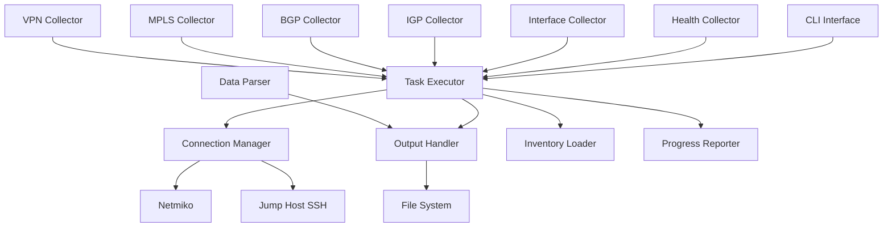
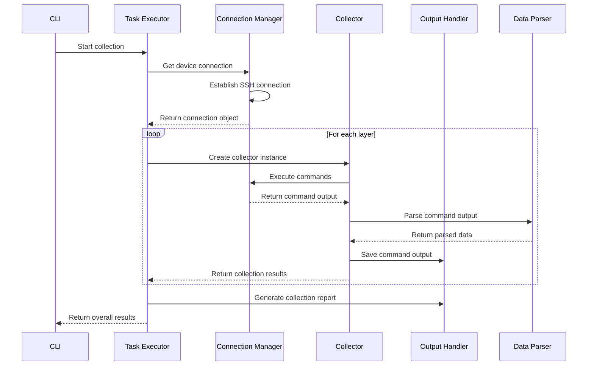
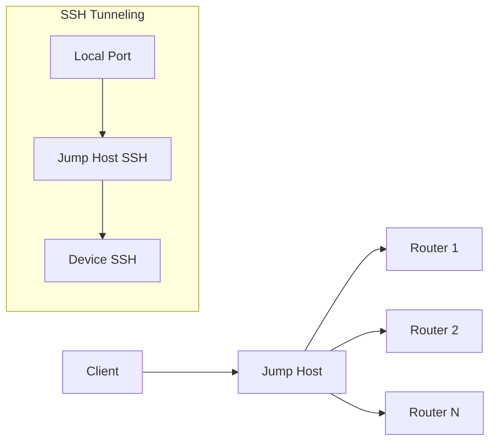

# 🏗️ Architecture Documentation - RR4 Complete Enhanced v4 CLI

This document provides a comprehensive overview of the architecture, design patterns, and technical implementation of the RR4 Complete Enhanced v4 CLI network data collection tool.

## 📋 Table of Contents

1. [System Overview](#system-overview)
2. [Core Architecture](#core-architecture)
3. [Module Structure](#module-structure)
4. [Data Flow](#data-flow)
5. [Design Patterns](#design-patterns)
6. [Core Components](#core-components)
7. [Collector Architecture](#collector-architecture)
8. [Connection Management](#connection-management)
9. [Error Handling Strategy](#error-handling-strategy)
10. [Performance Considerations](#performance-considerations)

## 🎯 System Overview

The RR4 Complete Enhanced v4 CLI is a modular, scalable network data collection system designed for enterprise-grade reliability and performance.

### Key Characteristics

- **Modular Design**: Independent, loosely-coupled components
- **Platform Agnostic**: Support for multiple Cisco platforms
- **Concurrent Processing**: Multi-threaded data collection
- **Extensible**: Easy addition of new collectors and platforms
- **Fault Tolerant**: Robust error handling and recovery
- **Jump Host Support**: Secure access through bastion hosts

## 🏛️ Core Architecture

### High-Level Architecture

```
┌─────────────────────────────────────────────────────────────┐
│                    RR4 Enhanced v4 CLI                     │
├─────────────────────────────────────────────────────────────┤
│  CLI Interface Layer (rr4-complete-enchanced-v4-cli.py)    │
├─────────────────────────────────────────────────────────────┤
│                Core Processing Layer                        │
│  ┌─────────────┐ ┌─────────────┐ ┌─────────────┐           │
│  │   Task      │ │ Connection  │ │   Output    │           │
│  │  Executor   │ │   Manager   │ │   Handler   │           │
│  └─────────────┘ └─────────────┘ └─────────────┘           │
├─────────────────────────────────────────────────────────────┤
│                Data Collection Layer                        │
│  ┌─────┐ ┌─────┐ ┌─────┐ ┌─────┐ ┌─────┐ ┌─────┐         │
│  │ IGP │ │ BGP │ │MPLS │ │VPN  │ │Int. │ │Health│        │
│  │Coll.│ │Coll.│ │Coll.│ │Coll.│ │Coll.│ │Coll. │        │
│  └─────┘ └─────┘ └─────┘ └─────┘ └─────┘ └─────┘         │
├─────────────────────────────────────────────────────────────┤
│                 Network Access Layer                        │
│  ┌─────────────┐ ┌─────────────┐ ┌─────────────┐           │
│  │   Netmiko   │ │   Nornir    │ │  Jump Host  │           │
│  │ Connection  │ │  Framework  │ │   Support   │           │
│  └─────────────┘ └─────────────┘ └─────────────┘           │
└─────────────────────────────────────────────────────────────┘
```

### Component Interaction



## 📦 Module Structure

### Directory Layout

```
V4codercli/
├── rr4_complete_enchanced_v4_cli_core/          # Core framework
│   ├── __init__.py
│   ├── task_executor.py                         # Task orchestration
│   ├── connection_manager.py                    # Connection handling
│   ├── output_handler.py                        # Data storage
│   ├── data_parser.py                          # Output parsing
│   └── inventory_loader.py                     # Device inventory
│
├── rr4_complete_enchanced_v4_cli_tasks/         # Data collectors
│   ├── __init__.py
│   ├── health_collector.py                     # System health
│   ├── interface_collector.py                  # Interface data
│   ├── igp_collector.py                        # IGP protocols
│   ├── bgp_collector.py                        # BGP protocol
│   ├── mpls_collector.py                       # MPLS/TE data
│   ├── vpn_collector.py                        # VPN/VRF data
│   ├── static_route_collector.py               # Static routes
│   └── base_collector.py                       # Base class (deprecated)
│
├── tests/                                       # Test suite
├── config/                                      # Configuration files
├── inventory/                                   # Device inventories
└── output/                                      # Collection output
```

### Import Architecture

The project uses **absolute imports** to avoid circular dependencies:

```python
# Core modules
from V4codercli.rr4_complete_enchanced_v4_cli_core.task_executor import TaskExecutor
from V4codercli.rr4_complete_enchanced_v4_cli_core.output_handler import OutputHandler

# Collector modules  
from V4codercli.rr4_complete_enchanced_v4_cli_tasks.igp_collector import IGPCollector
```

## 🔄 Data Flow

### Collection Process Flow



### Data Processing Pipeline

1. **Input Phase**
   - Load device inventory
   - Validate configuration
   - Initialize connections

2. **Collection Phase**
   - Establish device connections
   - Execute layer-specific commands
   - Parse command outputs
   - Store raw and parsed data

3. **Output Phase**
   - Generate collection reports
   - Create file structure
   - Save metadata

## 🎨 Design Patterns

### 1. Strategy Pattern (Collectors)

Each collector implements the same interface but with platform-specific strategies:

```python
class CollectorInterface:
    def collect_layer_data(self, connection, hostname, platform, output_handler):
        """Collect data for this layer."""
        pass
    
    def get_layer_info(self):
        """Return layer metadata."""
        pass
```

### 2. Factory Pattern (Connection Management)

Connection creation is handled by factory methods:

```python
class ConnectionManager:
    def get_connection(self, hostname, device_type, **kwargs):
        """Factory method to create appropriate connection."""
        if device_type.startswith('cisco'):
            return self._create_cisco_connection(hostname, device_type, **kwargs)
        elif device_type.startswith('juniper'):
            return self._create_juniper_connection(hostname, device_type, **kwargs)
```

### 3. Observer Pattern (Progress Reporting)

Progress updates are broadcast to registered observers:

```python
class ProgressReporter:
    def __init__(self):
        self.observers = []
    
    def add_observer(self, observer):
        self.observers.append(observer)
    
    def notify_progress(self, progress_data):
        for observer in self.observers:
            observer.update(progress_data)
```

### 4. Template Method Pattern (Base Collection)

Common collection workflow with customizable steps:

```python
def collect_layer_data(self, connection, hostname, platform, output_handler):
    # Template method defining the workflow
    commands = self.get_commands_for_platform(platform)
    results = self._initialize_results(hostname, platform)
    
    for command in commands:
        output = self._execute_command(connection, command)
        parsed_data = self._parse_output(command, output, platform)
        self._store_output(output_handler, hostname, command, output)
        self._analyze_output(command, output, results)
    
    return self._finalize_results(results)
```

## 🧩 Core Components

### Task Executor

**Purpose**: Orchestrates the entire collection process
**Key Responsibilities**:
- Device inventory management
- Collector instantiation and execution
- Progress tracking and reporting
- Error handling and recovery

```python
class TaskExecutor:
    def __init__(self, inventory, output_handler, max_workers=4):
        self.inventory = inventory
        self.output_handler = output_handler
        self.max_workers = max_workers
        self.progress = ProgressReporter()
    
    def execute_layer_collection(self, layers):
        """Execute collection for specified layers."""
        # Implementation details...
```

### Connection Manager

**Purpose**: Manages network device connections
**Key Features**:
- Jump host support
- Connection pooling
- Authentication handling
- Timeout management

```python
class ConnectionManager:
    def __init__(self, jump_host_config=None):
        self.jump_host_config = jump_host_config
        self.active_connections = {}
    
    def get_connection(self, hostname, device_type, **kwargs):
        """Get or create device connection."""
        # Implementation with connection reuse
```

### Output Handler

**Purpose**: Manages data storage and file organization
**Key Features**:
- Hierarchical file structure
- Metadata management
- Report generation
- File naming conventions

```python
class OutputHandler:
    def __init__(self, base_output_dir="rr4-complete-enchanced-v4-cli-output"):
        self.base_output_dir = Path(base_output_dir)
        self.collection_metadata = None
    
    def save_command_output(self, hostname, layer, command, output):
        """Save command output to appropriate file."""
        # Implementation details...
```

### Data Parser

**Purpose**: Processes command outputs into structured data
**Key Features**:
- pyATS/Genie integration
- Fallback text parsing
- Platform-specific handling
- Error tolerance

```python
class DataParser:
    def __init__(self):
        self.genie_available = GENIE_AVAILABLE
        self.parser_mapping = self._initialize_parser_mapping()
    
    def parse_output(self, command, output, platform):
        """Parse command output using appropriate parser."""
        # Implementation with fallback mechanisms
```

## 🔌 Collector Architecture

### Independent Collector Design

**Version 2.0.0 Architecture Change**: Removed problematic `BaseCollector` inheritance

#### Before (v1.x - Broken)
```python
class IGPCollector(BaseCollector):
    def __init__(self, device_type):
        super().__init__(device_type)  # device_type was None, causing crashes
```

#### After (v2.0.0 - Fixed)
```python
class IGPCollector:
    def __init__(self, connection=None):
        self.connection = connection
        self.logger = logging.getLogger('rr4_collector.igp_collector')
        self.data_parser = DataParser()
```

### Collector Interface

Each collector implements a consistent interface:

```python
def collect_layer_data(self, connection, hostname, platform, output_handler):
    """Collect data for this layer.
    
    Args:
        connection: Network device connection
        hostname: Device hostname
        platform: Device platform (ios, iosxe, iosxr)
        output_handler: Output handler instance
    
    Returns:
        Dict containing collection results
    """
```

### Platform Command Mapping

Collectors maintain platform-specific command sets:

```python
def get_commands_for_platform(self, platform):
    """Get commands for specific platform."""
    if platform.lower() == 'ios':
        return self._get_ios_commands()
    elif platform.lower() == 'iosxe':
        return self._get_iosxe_commands()
    elif platform.lower() == 'iosxr':
        return self._get_iosxr_commands()
```

## 🔗 Connection Management

### Jump Host Architecture



### Connection Flow

1. **Establish Jump Host Connection**
   ```python
   jump_ssh = paramiko.SSHClient()
   jump_ssh.connect(jump_host_ip, username, password)
   ```

2. **Create Device Tunnel**
   ```python
   tunnel = jump_ssh.get_transport().open_channel(
       'direct-tcpip', (device_ip, 22), ('127.0.0.1', 0)
   )
   ```

3. **Connect to Device**
   ```python
   device_connection = netmiko.ConnectHandler(
       device_type='cisco_ios',
       host=device_ip,
       username=device_username,
       password=device_password,
       sock=tunnel
   )
   ```

## 🛡️ Error Handling Strategy

### Hierarchical Error Handling

1. **Command Level**: Individual command failures
2. **Collector Level**: Layer collection failures
3. **Device Level**: Device connection failures
4. **System Level**: Overall collection failures

### Error Classification

```python
def _is_protocol_not_configured_error(self, error_message):
    """Classify protocol not configured errors."""
    not_configured_indicators = [
        'Invalid input detected',
        'No OSPF', 'No EIGRP', 'No BGP',
        'not configured', 'not enabled'
    ]
    return any(indicator.lower() in error_message.lower() 
              for indicator in not_configured_indicators)
```

### Recovery Strategies

- **Graceful Degradation**: Continue collection despite individual failures
- **Retry Logic**: Retry failed operations with exponential backoff
- **Fallback Mechanisms**: Use alternative commands or parsing methods
- **Detailed Logging**: Comprehensive error reporting for troubleshooting

## ⚡ Performance Considerations

### Concurrency Design

- **Multi-threading**: Concurrent device processing
- **Connection Pooling**: Reuse established connections
- **Asynchronous Operations**: Non-blocking I/O where possible

### Memory Management

- **Streaming Parsing**: Process large outputs in chunks
- **Garbage Collection**: Explicit cleanup of large objects
- **Connection Limits**: Limit concurrent connections

### Optimization Strategies

1. **Command Batching**: Group related commands
2. **Selective Collection**: Only collect required layers
3. **Caching**: Cache parsed data and connections
4. **Timeout Management**: Appropriate timeouts for different commands

### Performance Monitoring

```python
class PerformanceMonitor:
    def __init__(self):
        self.metrics = {
            'collection_time': 0,
            'commands_executed': 0,
            'data_processed': 0,
            'memory_usage': 0
        }
    
    def record_metric(self, metric_name, value):
        self.metrics[metric_name] = value
```

## 🔄 Extension Points

### Adding New Platforms

1. **Create platform-specific command mappings**
2. **Add connection handler**
3. **Update parser mappings**
4. **Add platform detection logic**

### Adding New Collectors

1. **Implement collector interface**
2. **Add to collector registry**
3. **Create platform-specific commands**
4. **Add tests and documentation**

### Custom Parsing

1. **Register custom parser**
2. **Implement parsing logic**
3. **Add to parser registry**

## 📊 Metrics and Monitoring

### Collection Metrics

- **Success Rate**: Percentage of successful collections
- **Performance**: Time per device/layer
- **Error Rate**: Types and frequency of errors
- **Resource Usage**: CPU, memory, network utilization

### Health Checks

- **Connection Status**: Device reachability
- **Service Status**: Collector availability
- **Resource Status**: System resource usage

## 🔮 Future Architecture Considerations

### Scalability Improvements

- **Microservices Architecture**: Split into independent services
- **API Gateway**: RESTful API for programmatic access
- **Database Integration**: Persistent storage for results
- **Cloud Native**: Kubernetes deployment support

### Enhanced Features

- **Real-time Monitoring**: Continuous data collection
- **AI/ML Integration**: Intelligent analysis and anomaly detection
- **Multi-vendor Support**: Juniper, Arista, and other vendors
- **Configuration Management**: Device configuration backup and restoration

This architecture provides a solid foundation for enterprise-grade network data collection while maintaining flexibility for future enhancements and scalability requirements. 