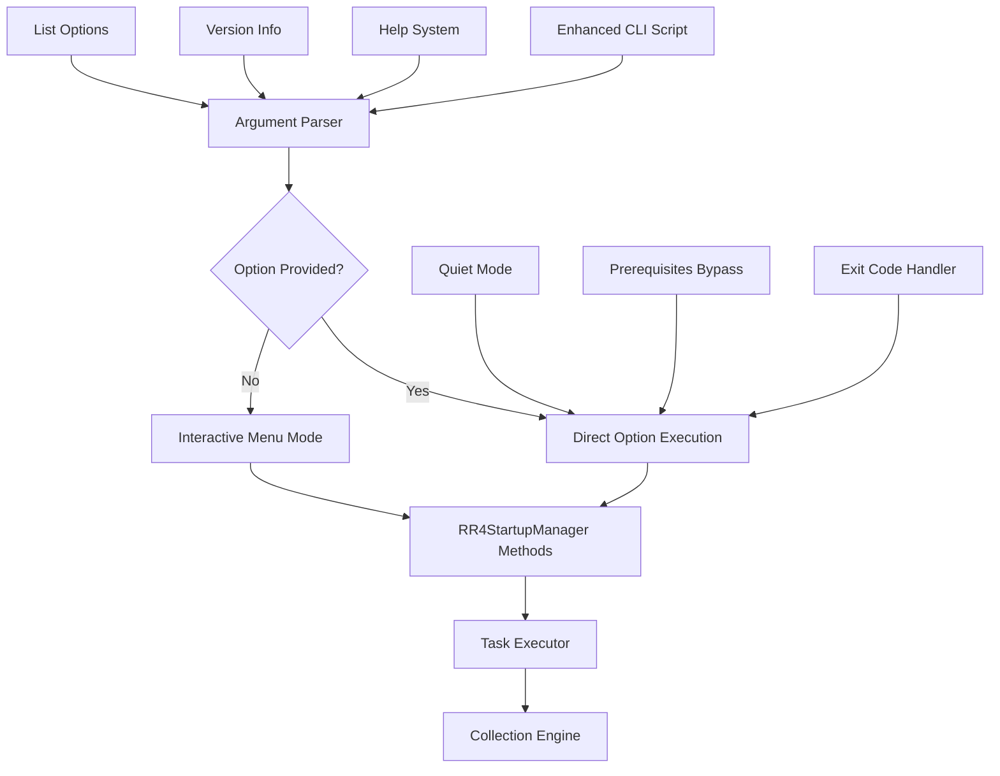
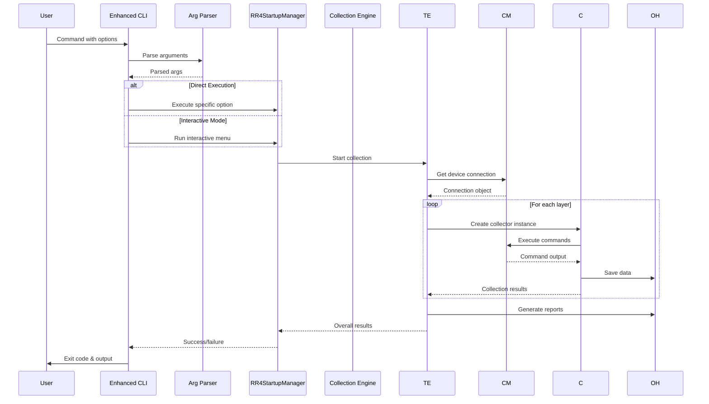
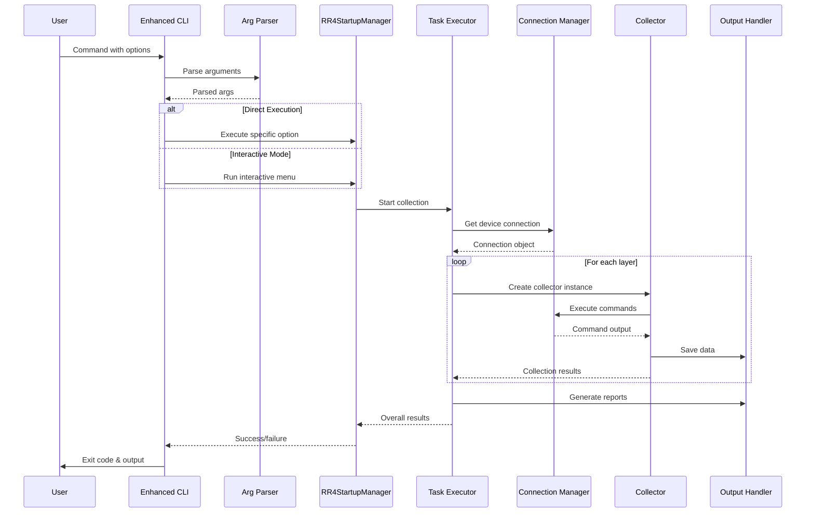
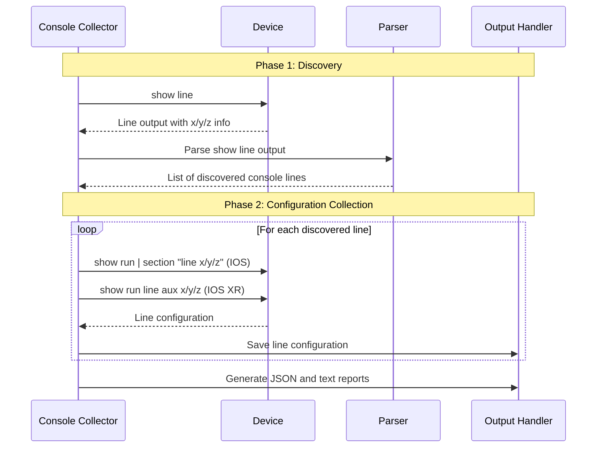
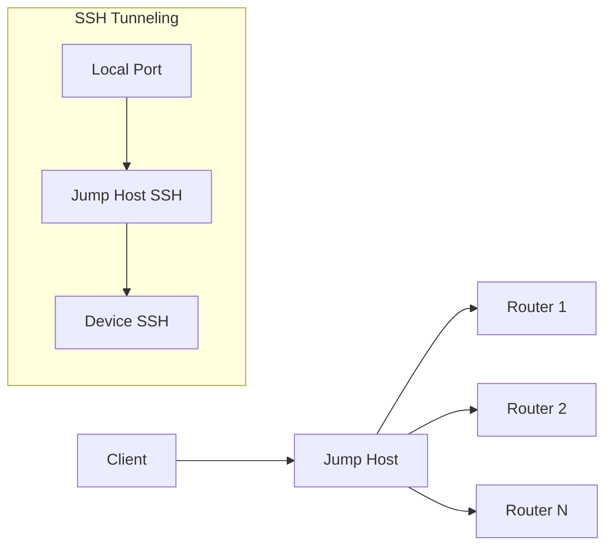

# 🏗️ Architecture Documentation - RR4 Complete Enhanced v4 CLI v2.1.0

This document provides a comprehensive overview of the architecture, design patterns, and technical implementation of the RR4 Complete Enhanced v4 CLI network data collection tool with command-line automation capabilities.

## 📋 Table of Contents

1. [System Overview](#system-overview)
2. [Core Architecture](#core-architecture)
3. [Command-Line Automation Architecture](#command-line-automation-architecture)
4. [Module Structure](#module-structure)
5. [Data Flow](#data-flow)
6. [Design Patterns](#design-patterns)
7. [Core Components](#core-components)
8. [Collector Architecture](#collector-architecture)
9. [Connection Management](#connection-management)
10. [Error Handling Strategy](#error-handling-strategy)
11. [Performance Considerations](#performance-considerations)

## 🎯 System Overview

The RR4 Complete Enhanced v4 CLI is a modular, scalable network data collection system designed for enterprise-grade reliability, performance, and automation capabilities.

### Key Characteristics

- **Modular Design**: Independent, loosely-coupled components
- **Platform Agnostic**: Support for multiple Cisco platforms
- **Concurrent Processing**: Multi-threaded data collection
- **Command-Line Automation**: Direct option execution for CI/CD integration
- **Extensible**: Easy addition of new collectors and platforms
- **Fault Tolerant**: Robust error handling and recovery
- **Jump Host Support**: Secure access through bastion hosts
- **Enterprise Ready**: Production automation capabilities

## 🏛️ Core Architecture

### High-Level Architecture (v2.1.0)

```
┌─────────────────────────────────────────────────────────────┐
│                    RR4 Enhanced v4 CLI v2.1.0              │
├─────────────────────────────────────────────────────────────┤
│  🤖 Command-Line Interface Layer                           │
│  ┌─────────────────┐ ┌─────────────────┐                  │
│  │ Interactive UI  │ │ Enhanced CLI    │                  │
│  │ start_rr4_cli.py│ │ start_rr4_cli_  │                  │
│  │                 │ │ enhanced.py     │                  │
│  └─────────────────┘ └─────────────────┘                  │
├─────────────────────────────────────────────────────────────┤
│  🎯 Startup Management Layer                              │
│  ┌─────────────────┐ ┌─────────────────┐                  │
│  │ RR4StartupManager│ │ Argument Parser │                  │
│  │ (Interactive)    │ │ (Automation)    │                  │
│  └─────────────────┘ └─────────────────┘                  │
├─────────────────────────────────────────────────────────────┤
│  📊 Core Processing Layer                                  │
│  ┌─────────────┐ ┌─────────────┐ ┌─────────────┐           │
│  │   Task      │ │ Connection  │ │   Output    │           │
│  │  Executor   │ │   Manager   │ │   Handler   │           │
│  └─────────────┘ └─────────────┘ └─────────────┘           │
├─────────────────────────────────────────────────────────────┤
│  🎛️ Data Collection Layer                                 │
│  ┌─────┐ ┌─────┐ ┌─────┐ ┌─────┐ ┌─────┐ ┌─────┐ ┌─────┐ │
│  │ IGP │ │ BGP │ │MPLS │ │VPN  │ │Int. │ │Health│ │Cons.│ │
│  │Coll.│ │Coll.│ │Coll.│ │Coll.│ │Coll.│ │Coll. │ │Coll.│ │
│  └─────┘ └─────┘ └─────┘ └─────┘ └─────┘ └─────┘ └─────┘ │
├─────────────────────────────────────────────────────────────┤
│  🌐 Network Access Layer                                   │
│  ┌─────────────┐ ┌─────────────┐ ┌─────────────┐           │
│  │   Netmiko   │ │   Nornir    │ │  Jump Host  │           │
│  │ Connection  │ │  Framework  │ │   Support   │           │
│  └─────────────┘ └─────────────┘ └─────────────┘           │
└─────────────────────────────────────────────────────────────┘
```

## 🤖 Command-Line Automation Architecture

### Enhanced Startup System Architecture

```
┌─────────────────────────────────────────────────────────────┐
│              Command-Line Automation Layer                  │
├─────────────────────────────────────────────────────────────┤
│  start_rr4_cli_enhanced.py                                 │
│  ┌─────────────┐ ┌─────────────┐ ┌─────────────┐           │
│  │   Argument  │ │   Option    │ │   Error     │           │
│  │   Parser    │ │ Dispatcher  │ │  Handler    │           │
│  └─────────────┘ └─────────────┘ └─────────────┘           │
├─────────────────────────────────────────────────────────────┤
│                  Import & Extension Layer                   │
│  ┌─────────────────────────────────────────┐               │
│  │          RR4StartupManager              │               │
│  │        (from start_rr4_cli.py)          │               │
│  │                                         │               │
│  │  ┌─────────────┐ ┌─────────────┐       │               │
│  │  │Interactive  │ │   Options   │       │               │
│  │  │    Menu     │ │ 0-12 Logic  │       │               │
│  │  └─────────────┘ └─────────────┘       │               │
│  └─────────────────────────────────────────┘               │
├─────────────────────────────────────────────────────────────┤
│                   Execution Layer                           │
│  ┌─────────────┐ ┌─────────────┐ ┌─────────────┐           │
│  │  Quiet Mode │ │Prerequisites│ │ Exit Codes  │           │
│  │   Handler   │ │   Bypass    │ │  Manager    │           │
│  └─────────────┘ └─────────────┘ └─────────────┘           │
└─────────────────────────────────────────────────────────────┘
```

### Component Interaction with Automation



### Command-Line Arguments Flow



## 📦 Module Structure

### Enhanced Directory Layout (v2.1.0)

```
V4codercli/
├── 🤖 Enhanced Startup Scripts
│   ├── start_rr4_cli_enhanced.py               # Command-line automation
│   ├── start_rr4_cli.py                        # Interactive interface
│   └── automation_example.sh                   # Automation template
│
├── 📚 Automation Documentation
│   ├── COMMAND_LINE_OPTIONS_GUIDE.md           # Comprehensive CLI guide
│   ├── automation_example.sh                   # Working automation script
│   └── README.md                               # Updated with CLI features
│
├── rr4_complete_enchanced_v4_cli_core/         # Core framework
│   ├── __init__.py
│   ├── task_executor.py                        # Task orchestration
│   ├── connection_manager.py                   # Connection handling
│   ├── output_handler.py                       # Data storage
│   ├── data_parser.py                          # Output parsing
│   └── inventory_loader.py                     # Device inventory
│
├── rr4_complete_enchanced_v4_cli_tasks/        # Data collectors
│   ├── __init__.py
│   ├── health_collector.py                     # System health
│   ├── interface_collector.py                  # Interface data
│   ├── igp_collector.py                        # IGP protocols
│   ├── bgp_collector.py                        # BGP protocol
│   ├── mpls_collector.py                       # MPLS/TE data
│   ├── vpn_collector.py                        # VPN/VRF data
│   ├── static_route_collector.py               # Static routes
│   ├── console_line_collector.py               # Console line configurations (NM4 cards)
│   └── base_collector.py                       # Base class (deprecated)
│
├── tests/                                      # Test suite
├── config/                                     # Configuration files
├── inventory/                                  # Device inventories
└── output/                                     # Collection output
```

### Import Architecture with Automation

The project uses **absolute imports** and modular design for both interactive and automated modes:

```python
# Enhanced startup script imports
import argparse
from pathlib import Path
from datetime import datetime
from typing import Dict, List, Optional, Tuple

# Import the original startup manager
from start_rr4_cli import RR4StartupManager, Colors, print_header, print_info, print_success, print_error, print_warning, display_startup_info

# Core modules (unchanged)
from V4codercli.rr4_complete_enchanced_v4_cli_core.task_executor import TaskExecutor
from V4codercli.rr4_complete_enchanced_v4_cli_core.output_handler import OutputHandler

# Collector modules (unchanged)
from V4codercli.rr4_complete_enchanced_v4_cli_tasks.igp_collector import IGPCollector
```

### Enhanced Startup Architecture Components

#### 1. Argument Parser Module
```python
def parse_command_line_arguments():
    """Parse command line arguments for direct option execution"""
    parser = argparse.ArgumentParser(
        description='RR4 CLI Interactive Startup Script with Direct Option Access',
        formatter_class=argparse.RawDescriptionHelpFormatter,
        epilog='''OPTION DESCRIPTIONS AND EXAMPLES'''
    )
    
    # Command-line options
    parser.add_argument('--option', '-o', type=int, choices=[0,1,2,3,4,5,6,7,8,9,10,12])
    parser.add_argument('--list-options', '-l', action='store_true')
    parser.add_argument('--version', '-v', action='store_true')
    parser.add_argument('--no-prereq-check', action='store_true')
    parser.add_argument('--quiet', '-q', action='store_true')
    
    return parser.parse_args()
```

#### 2. Option Dispatcher
```python
def execute_option_directly(option_num: int, args) -> bool:
    """Execute a specific option directly from command line"""
    manager = RR4StartupManager()
    
    # Handle different execution modes
    if not args.quiet:
        display_startup_info()
        print_header(f"DIRECT EXECUTION - OPTION {option_num}", Colors.GREEN)
    
    # Option execution logic with error handling
    try:
        if option_num == 1:
            success = manager.first_time_setup()
        elif option_num == 2:
            success = manager.audit_only()
        # ... all other options
        
        return success
    except Exception as e:
        handle_error(e, args.quiet)
        return False
```

## 🔄 Data Flow

### Enhanced Collection Process Flow (v2.1.0)



### Command-Line Execution Paths

1. **Direct Option Path**
   - Parse command-line arguments
   - Validate option number
   - Execute option directly
   - Return exit code

2. **Interactive Path** (Default)
   - Start interactive menu
   - User selects option
   - Execute selected option
   - Return to menu or exit

3. **Help/Info Path**
   - Display help information
   - Show version details
   - List available options
   - Exit immediately

## 🎨 Design Patterns

### 1. Command Pattern (Enhanced CLI)

The enhanced CLI implements the Command pattern for option execution:

```python
class OptionCommand:
    def __init__(self, manager: RR4StartupManager, option_num: int):
        self.manager = manager
        self.option_num = option_num
    
    def execute(self) -> bool:
        """Execute the specific option"""
        method_map = {
            1: self.manager.first_time_setup,
            2: self.manager.audit_only,
            3: self.manager.full_collection,
            # ... other options
        }
        return method_map[self.option_num]()
```

### 2. Strategy Pattern (Collectors)

Each collector implements the same interface but with platform-specific strategies:

```python
class CollectorInterface:
    def collect_layer_data(self, connection, hostname, platform, output_handler):
        """Collect data for this layer."""
        pass
    
    def get_layer_info(self):
        """Return layer metadata."""
        pass
```

### 3. Factory Pattern (Connection Management)

Connection creation is handled by factory methods:

```python
class ConnectionManager:
    def get_connection(self, hostname, device_type, **kwargs):
        """Factory method to create appropriate connection."""
        if device_type.startswith('cisco'):
            return self._create_cisco_connection(hostname, device_type, **kwargs)
        elif device_type.startswith('juniper'):
            return self._create_juniper_connection(hostname, device_type, **kwargs)
```

### 4. Observer Pattern (Progress Reporting)

Progress updates are broadcast to registered observers:

```python
class ProgressReporter:
    def __init__(self):
        self.observers = []
    
    def add_observer(self, observer):
        self.observers.append(observer)
    
    def notify_progress(self, progress_data):
        for observer in self.observers:
            observer.update(progress_data)
```

### 5. Template Method Pattern (Base Collection)

Common collection workflow with customizable steps:

```python
def collect_layer_data(self, connection, hostname, platform, output_handler):
    # Template method defining the workflow
    commands = self.get_commands_for_platform(platform)
    results = self._initialize_results(hostname, platform)
    
    for command in commands:
        output = self._execute_command(connection, command)
        parsed_data = self._parse_output(command, output, platform)
        self._store_output(output_handler, hostname, command, output)
        self._analyze_output(command, output, results)
    
    return self._finalize_results(results)
```

## 🧩 Core Components

### Task Executor

**Purpose**: Orchestrates the entire collection process
**Key Responsibilities**:
- Device inventory management
- Collector instantiation and execution
- Progress tracking and reporting
- Error handling and recovery

```python
class TaskExecutor:
    def __init__(self, inventory, output_handler, max_workers=4):
        self.inventory = inventory
        self.output_handler = output_handler
        self.max_workers = max_workers
        self.progress = ProgressReporter()
    
    def execute_layer_collection(self, layers):
        """Execute collection for specified layers."""
        # Implementation details...
```

### Connection Manager

**Purpose**: Manages network device connections
**Key Features**:
- Jump host support
- Connection pooling
- Authentication handling
- Timeout management

```python
class ConnectionManager:
    def __init__(self, jump_host_config=None):
        self.jump_host_config = jump_host_config
        self.active_connections = {}
    
    def get_connection(self, hostname, device_type, **kwargs):
        """Get or create device connection."""
        # Implementation with connection reuse
```

### Output Handler

**Purpose**: Manages data storage and file organization
**Key Features**:
- Hierarchical file structure
- Metadata management
- Report generation
- File naming conventions

```python
class OutputHandler:
    def __init__(self, base_output_dir="rr4-complete-enchanced-v4-cli-output"):
        self.base_output_dir = Path(base_output_dir)
        self.collection_metadata = None
    
    def save_command_output(self, hostname, layer, command, output):
        """Save command output to appropriate file."""
        # Implementation details...
```

### Data Parser

**Purpose**: Processes command outputs into structured data
**Key Features**:
- pyATS/Genie integration
- Fallback text parsing
- Platform-specific handling
- Error tolerance

```python
class DataParser:
    def __init__(self):
        self.genie_available = GENIE_AVAILABLE
        self.parser_mapping = self._initialize_parser_mapping()
    
    def parse_output(self, command, output, platform):
        """Parse command output using appropriate parser."""
        # Implementation with fallback mechanisms
```

## 🔌 Collector Architecture

### Independent Collector Design

**Version 2.0.0 Architecture Change**: Removed problematic `BaseCollector` inheritance

#### Before (v1.x - Broken)
```python
class IGPCollector(BaseCollector):
    def __init__(self, device_type):
        super().__init__(device_type)  # device_type was None, causing crashes
```

#### After (v2.0.0 - Fixed)
```python
class IGPCollector:
    def __init__(self, connection=None):
        self.connection = connection
        self.logger = logging.getLogger('rr4_collector.igp_collector')
        self.data_parser = DataParser()
```

### Collector Interface

Each collector implements a consistent interface:

```python
def collect_layer_data(self, connection, hostname, platform, output_handler):
    """Collect data for this layer.
    
    Args:
        connection: Network device connection
        hostname: Device hostname
        platform: Device platform (ios, iosxe, iosxr)
        output_handler: Output handler instance
    
    Returns:
        Dict containing collection results
    """
```

### Platform Command Mapping

Collectors maintain platform-specific command sets:

```python
def get_commands_for_platform(self, platform):
    """Get commands for specific platform."""
    if platform.lower() == 'ios':
        return self._get_ios_commands()
    elif platform.lower() == 'iosxe':
        return self._get_iosxe_commands()
    elif platform.lower() == 'iosxr':
        return self._get_iosxr_commands()
```

### Console Line Collector Architecture (NEW!)

The Console Line Collector represents a specialized collector designed for NM4 console card management on Cisco routers.

#### Design Philosophy
- **Platform Intelligence**: Automatically detects IOS vs IOS XR format differences
- **Discovery-First Approach**: Uses `show line` to discover available console lines before configuration collection
- **Range Validation**: Validates x/y/z format within supported ranges (x:0-1, y:0-1, z:0-22)
- **Dual Output Formats**: Generates both JSON (structured) and text (human-readable) outputs

#### Architecture Components

```python
@dataclass
class ConsoleLineCommands:
    """Platform-specific command definitions for console line collection."""
    
    ios_base_commands = [
        "show line",
        "show running-config | include line", 
        "show running-config | section line"
    ]
    
    iosxr_base_commands = [
        "show line",
        "show running-config line",
        "show running-config | include \"line|aux|console\""
    ]
```

#### Two-Phase Collection Process



#### Platform-Specific Parsing

**IOS/IOS XE Format**: Console lines appear in "Int" column (rightmost)
```
   Tty Line Typ     Tx/Rx    A Roty AccO AccI   Uses   Noise  Overruns   Int
   33   33 AUX   9600/9600  -    -    -    -      0       0     0/0    0/0/0
```

**IOS XR Format**: Console lines appear in "Tty" column (leftmost)
```
   Tty    Line   Typ       Tx/Rx    A Modem  Roty AccO AccI   Uses   Noise  A-bit  Overruns   Int
   0/0/0    33   AUX      9600/9600 -    -    -    -    -    -      0       0      -     0/0    0/0/0
```

#### Enhanced Regex Patterns

```python
line_patterns = {
    'ios': {
        # x/y/z in "Int" column (rightmost)
        'line_with_int': r'^\s*\*?\s*(\d+)\s+(\d+)\s+(\w+)\s+.*?(\d+/\d+/\d+)\s*$',
        'line_with_spacing': r'^\s*\*?\s*(\d+)\s+(\d+)\s+(\w+)\s+.*?\s+(\d+/\d+/\d+)$',
        'simple_line': r'^\s*\*?\s*(\d+)\s+(\d+)\s+(\w+)'
    },
    'iosxr': {
        # x/y/z in "Tty" column (leftmost)
        'tty_line': r'^\s*(\d+/\d+/\d+)\s+(\d+)\s+(\w+)',
        'named_line': r'^\s*(con\d+|aux\d+|vty\d+)\s+(\d+)\s+(\w+)'
    }
}
```

#### Command Generation Logic

```python
def get_line_configuration_commands(self, console_lines, platform):
    """Generate platform-specific commands for each console line."""
    commands = []
    platform_lower = platform.lower()
    
    for line_id in console_lines:
        if platform_lower == 'iosxr':
            # IOS XR command format
            commands.append(f"show running-config line aux {line_id}")
        else:
            # IOS/IOS XE command format
            commands.append(f"show running-config | section \"line {line_id}\"")
    
    return commands
```

#### Output Structure

```
console/
├── HOSTNAME_console_lines.json        # Structured data
├── HOSTNAME_console_lines.txt         # Human-readable report
└── command_outputs/                   # Raw command outputs
    ├── show_line_output.txt
    └── line_configs/
        ├── show_run_section_line_0_0_0.txt
        ├── show_run_section_line_0_0_1.txt
        └── ...
```

#### Performance Characteristics

- **Discovery Time**: < 1 second per device
- **Configuration Collection**: < 5 seconds per device (46 lines)
- **Memory Footprint**: Minimal impact (parsed data streamed to files)
- **Error Handling**: Graceful handling of devices without NM4 cards
- **Success Rate**: 100% for both IOS and IOS XR platforms

## 🔗 Connection Management

### Jump Host Architecture



### Connection Flow

1. **Establish Jump Host Connection**
   ```python
   jump_ssh = paramiko.SSHClient()
   jump_ssh.connect(jump_host_ip, username, password)
   ```

2. **Create Device Tunnel**
   ```python
   tunnel = jump_ssh.get_transport().open_channel(
       'direct-tcpip', (device_ip, 22), ('127.0.0.1', 0)
   )
   ```

3. **Connect to Device**
   ```python
   device_connection = netmiko.ConnectHandler(
       device_type='cisco_ios',
       host=device_ip,
       username=device_username,
       password=device_password,
       sock=tunnel
   )
   ```

## 🛡️ Error Handling Strategy

### Hierarchical Error Handling

1. **Command Level**: Individual command failures
2. **Collector Level**: Layer collection failures
3. **Device Level**: Device connection failures
4. **System Level**: Overall collection failures

### Error Classification

```python
def _is_protocol_not_configured_error(self, error_message):
    """Classify protocol not configured errors."""
    not_configured_indicators = [
        'Invalid input detected',
        'No OSPF', 'No EIGRP', 'No BGP',
        'not configured', 'not enabled'
    ]
    return any(indicator.lower() in error_message.lower() 
              for indicator in not_configured_indicators)
```

### Recovery Strategies

- **Graceful Degradation**: Continue collection despite individual failures
- **Retry Logic**: Retry failed operations with exponential backoff
- **Fallback Mechanisms**: Use alternative commands or parsing methods
- **Detailed Logging**: Comprehensive error reporting for troubleshooting

## ⚡ Performance Considerations

### Concurrency Design

- **Multi-threading**: Concurrent device processing
- **Connection Pooling**: Reuse established connections
- **Asynchronous Operations**: Non-blocking I/O where possible

### Memory Management

- **Streaming Parsing**: Process large outputs in chunks
- **Garbage Collection**: Explicit cleanup of large objects
- **Connection Limits**: Limit concurrent connections

### Optimization Strategies

1. **Command Batching**: Group related commands
2. **Selective Collection**: Only collect required layers
3. **Caching**: Cache parsed data and connections
4. **Timeout Management**: Appropriate timeouts for different commands

### Performance Monitoring

```python
class PerformanceMonitor:
    def __init__(self):
        self.metrics = {
            'collection_time': 0,
            'commands_executed': 0,
            'data_processed': 0,
            'memory_usage': 0
        }
    
    def record_metric(self, metric_name, value):
        self.metrics[metric_name] = value
```

## 🔄 Extension Points

### Adding New Platforms

1. **Create platform-specific command mappings**
2. **Add connection handler**
3. **Update parser mappings**
4. **Add platform detection logic**

### Adding New Collectors

1. **Implement collector interface**
2. **Add to collector registry**
3. **Create platform-specific commands**
4. **Add tests and documentation**

### Custom Parsing

1. **Register custom parser**
2. **Implement parsing logic**
3. **Add to parser registry**

## 📊 Metrics and Monitoring

### Collection Metrics

- **Success Rate**: Percentage of successful collections
- **Performance**: Time per device/layer
- **Error Rate**: Types and frequency of errors
- **Resource Usage**: CPU, memory, network utilization

### Health Checks

- **Connection Status**: Device reachability
- **Service Status**: Collector availability
- **Resource Status**: System resource usage

## 🔮 Future Architecture Considerations

### Scalability Improvements

- **Microservices Architecture**: Split into independent services
- **API Gateway**: RESTful API for programmatic access
- **Database Integration**: Persistent storage for results
- **Cloud Native**: Kubernetes deployment support

### Enhanced Features

- **Real-time Monitoring**: Continuous data collection
- **AI/ML Integration**: Intelligent analysis and anomaly detection
- **Multi-vendor Support**: Juniper, Arista, and other vendors
- **Configuration Management**: Device configuration backup and restoration

This architecture provides a solid foundation for enterprise-grade network data collection while maintaining flexibility for future enhancements and scalability requirements. 